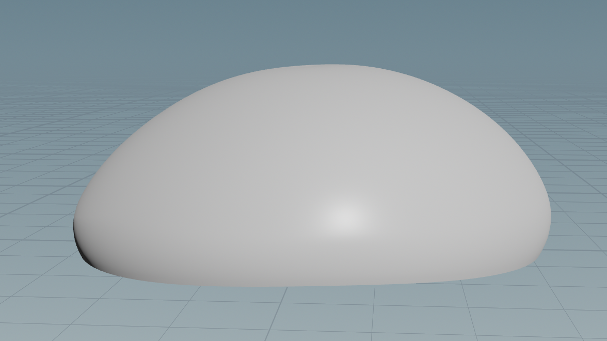
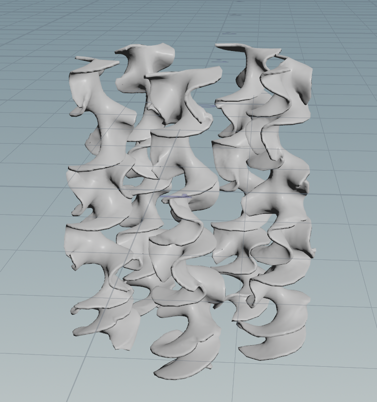
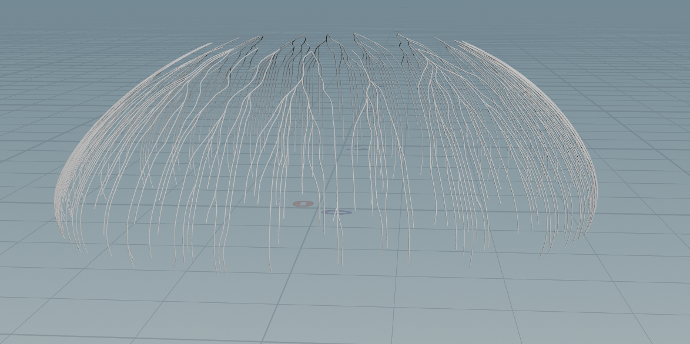
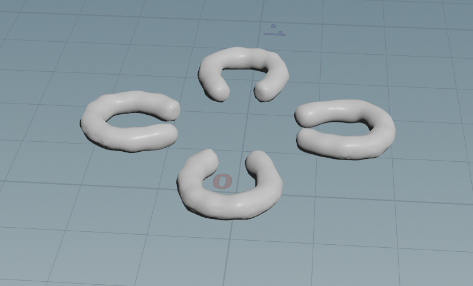
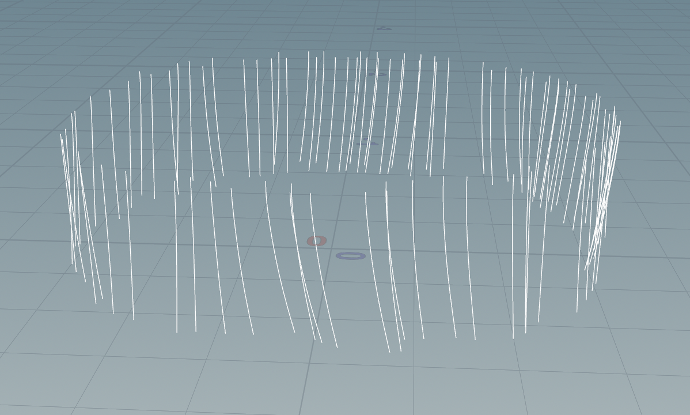
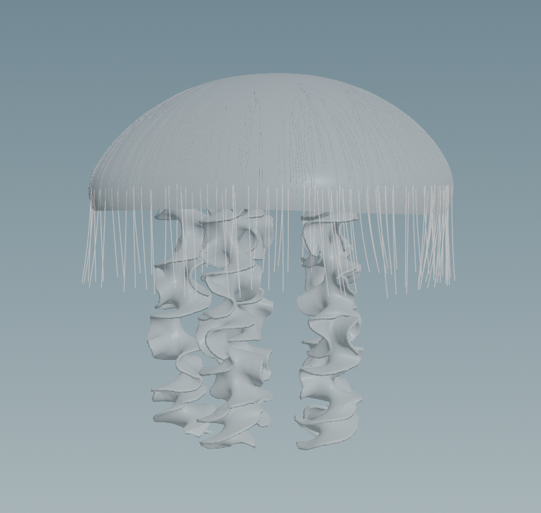

# Procedural Jellyfish

In this project I create and animate a procedural jellyfish in Houdini. The jellyfish has five main parts: the bell, arms, veins, organs, and tentacles.

### Bell

For the bell, I started from a line, bent it into a curve, and then revolved it to get the main shape. Then I distorted it with noise and animated it with keyframes changing the bend angles and y value.

### Arms

The arms are created from a xy plane grid by distorting the z value with noise based on how close to the edge of the grid a point is. Then it is twisted into shape and copied for each of the tentacles. Finally we apply a cloth simulation to it and pin each tentacle's top points to match the bell's movement.

### Veins

The veins are created by forming two groups of points containing the starts of the veins and the ends of the veins. From there we use the find shortest path node in order to create the vein lines, and then sweep those lines to give them actual volume. Like the arms, the veins follow the bell's animation.

### Organs

I made the organs by first drawing a horshoe shaped curve and then sweeping and capping it. I then add noise using the mountain node and again have it follow the bell's animation.

### Tentacles

Finally, for the tentacles I scatter points along the bottom of the bell and then extend each of those points into a line. Like the arms, the tops of the tentacles are pinned to follow the bells animation, and then I apply a hair simulation to animate them.

### Full Jellyfish

And here's an image of the full Jellyfish!

